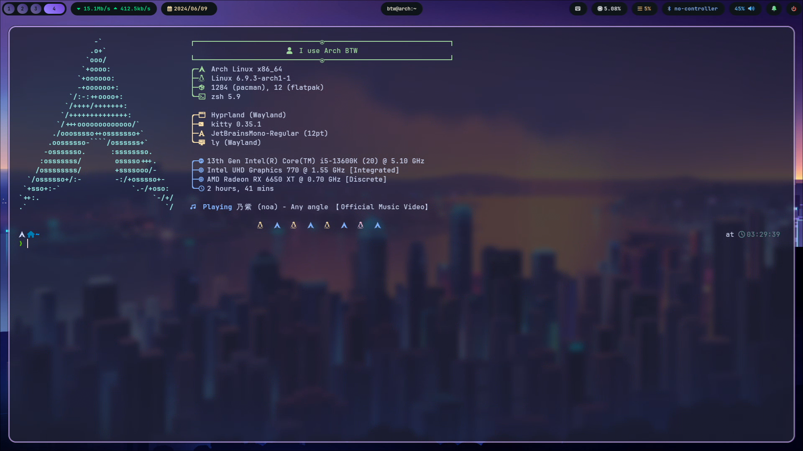
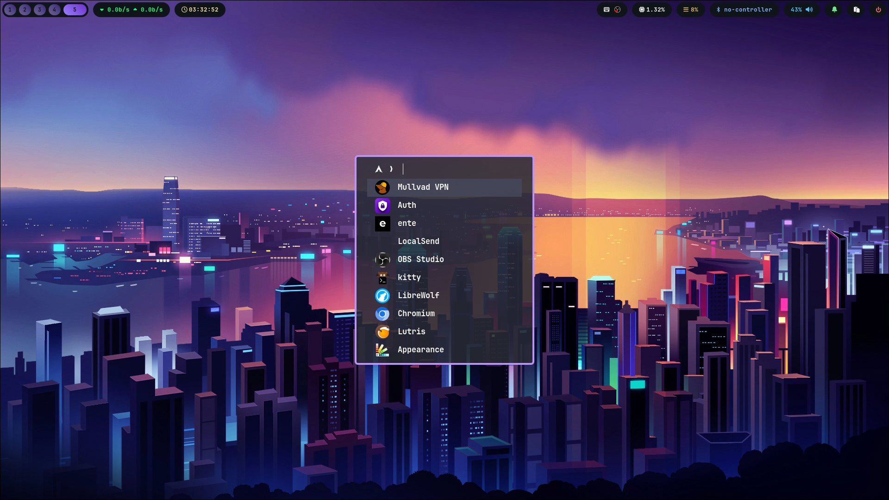
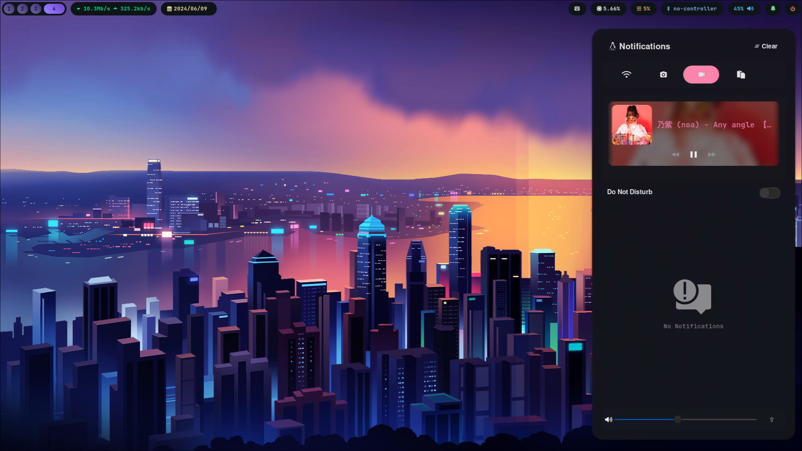
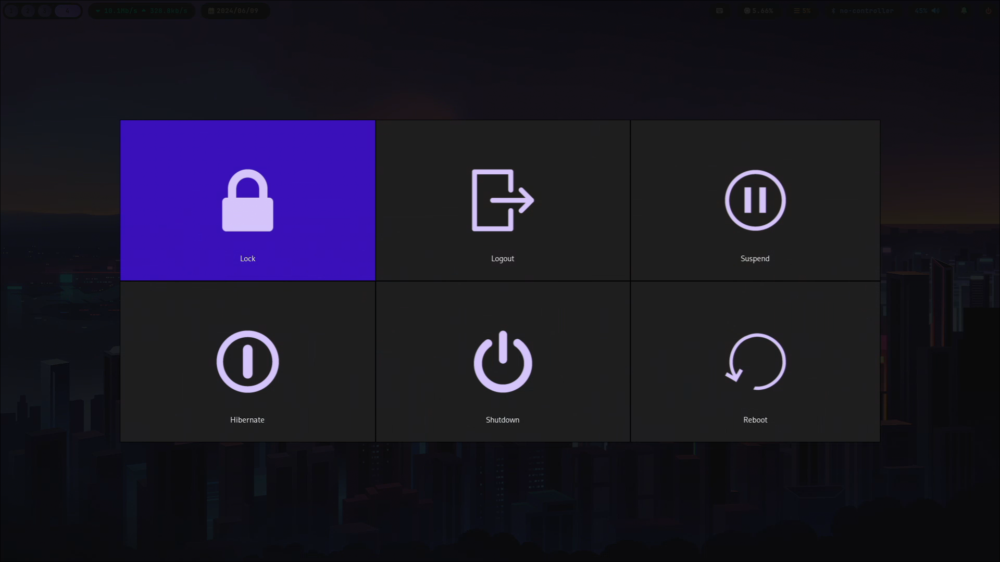
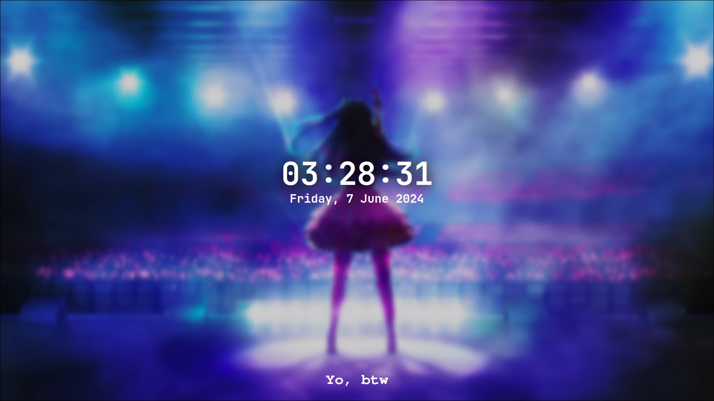

# Dotfiles

This repository is dedicated to my Hyprland WM Arch Linux configuration files.

## Installation instructions

To use it, execute the following command in your new environment:

***Tips: You can simplify the installation process by leveraging archinstall for easy installation of Arch Linux.***

> **⚠️ Warning**
> **This script is currently in beta. For added safety, it's advisable to manually copy the file to **~/.config/** rather than executing it directly.**
> **Running this script will automatically install all required packages and overwrite any existing .config files with the same filenames. Make sure to back up any important configurations before proceeding.**

### Mirror Installtion

You can select your preferred mirror for installation. Here's my Mirror

| DevOps       | Installation Command                                                              |
|--------------|---------------------------------------------------------------------------------- |
| Gitlab       | `bash <(curl -s https://gitlab.com/UmmIt/dotfiles/-/raw/main/setup.sh)`           |
| Codeberg     | `bash <(curl -s https://codeberg.org/UmmIt/Dotfiles/raw/branch/main/setup.sh)`    |
| Github       | `bash <(curl -s https://raw.githubusercontent.com/UmmItC/Dotfiles/main/setup.sh)` |

### Usage packages

| Module Type              | Module Name     | Package Manager |
|--------------------------|-----------------|-----------------|
| System Information       | Fastfetch       | Pacman          |
| Prompt Theme             | Powerlevel10k   | Manually (Git)  |
| Terminal Emulator        | Kitty           | Pacman          |
| Shell                    | Zsh             | Pacman          |
| Shell Framework          | Oh My Zsh       | Manually (Git)  |
| Window Manager           | Hyprland        | Pacman          |
| Power Management         | Wlogout         | AUR             |
| Status Bar               | Waybar          | Pacman          |
| Application Launcher     | Fuzzel          | Pacman          |
| Wallpaper Engine         | Swwww           | AUR             |
| Text Editor              | Neovim          | Pacman          |
| Notification Deamon      | Swaync          | Pacman          |
| Clipboard Utility        | Cliphist        | Pacman          |
| Clipboard Manager        | Clipmenu        | Pacman          |
| Screenlock Management    | Hyprlock        | Pacman          |
| Screenshot               | Hyprshot        | AUR             |
| Display Manager          | Ly              | Pacman          |
| Sound Server             | Pulseaudio      | Pacman          |
| AUR Helper               | Yay             | Manually (Git)  |
| Icon Theme               | Papirus         | Pacman          |

### Screenshots

