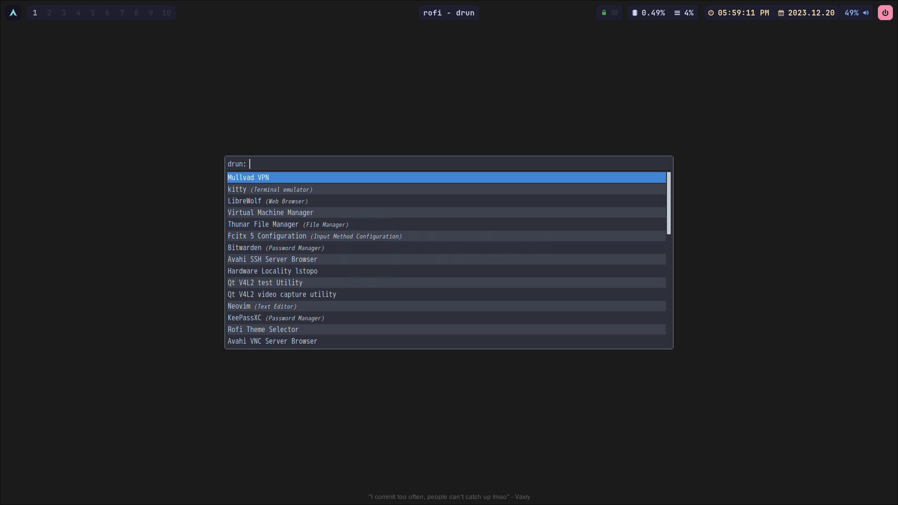

## Dotfiles

This repository is dedicated to my Hyprland WM Arch Linux configuration files.

## Installation

To use it, enter the following command

> **⚠️ Warning**
> **The install.sh is currently only a beta, so it might be best to copy the file directly to ``~/.config/*`.**
> **This script will automatically installing all the Necessary packages. and Relace all of your current .config files with the same filename. Please be aware of this.**

```shell
chmod +x install.sh
./install.sh
```

## Require Packages

currently, the repository contains the following configuration files:

- Neofetch (pacman) - System confi
- Powerlevel10k (manually) - oh my zsh theme
- Oh my zsh (pacman) - zsh framework
- Hyprland (pacman) - Windows Manager
- waybar (pacman - Status bar)
- wlogout (yay) - Power management
- hyprshot (yay) - Screenshot
- rofi (pacman) - App launcher
- hyprpaper (pacman) - Wallpaper
- Neovim (NvChad) - text editor
- Viu - Simple Terminal Image Viewer

## Screenshot



