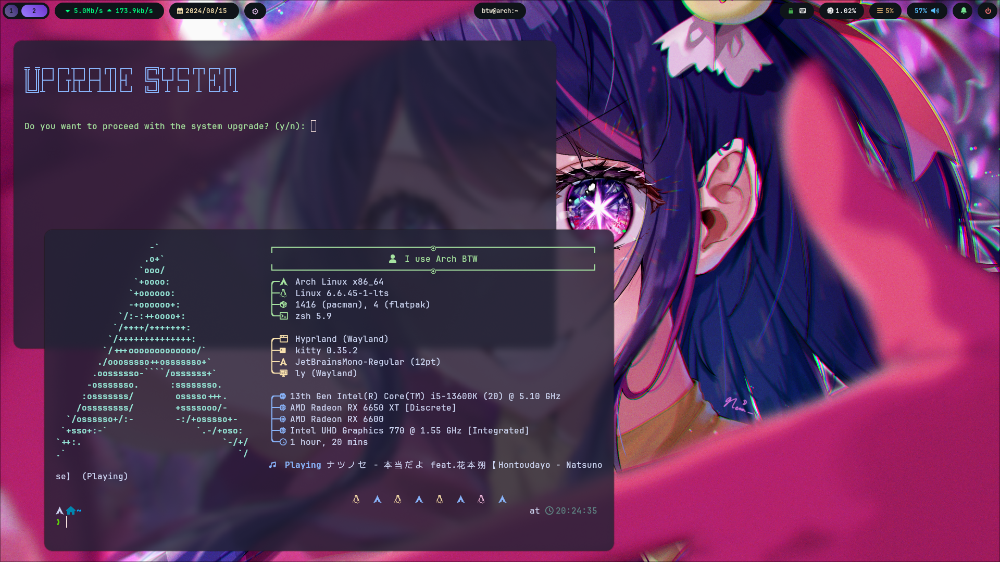

# Dotfiles

This repository is dedicated to my Hyprland DWM Arch Linux configuration files.



# Installation Instructions

For users on Arch Linux, I’ve created a script to streamline the setup process. You can run the script to automatically configure your system. Alternatively, you can manually copy the configuration files to your system using the `cp` command.

To run the script:

1. Download or clone the repository.
2. Navigate to the directory containing the script.
3. Execute the script according to the provided instructions.

```shell
chmod +x ./install.sh
./install.sh
```

## For manual configuration:

Just Copy the necessary files you want to your configuration directory:
   
```sh
cp -rv path/to/source/file /path/to/destination/
```

## Mirror Select

You can set up your system quickly without needing to clone or download the script separately. Simply use bash and curl to fetch and execute `setup.sh`, and then follow the prompts to complete the process.

| DevOps       | Installation Command                                                              |
|--------------|---------------------------------------------------------------------------------- |
| Gitlab       | `bash <(curl -s https://gitlab.com/UmmIt/dotfiles/-/raw/main/setup.sh)`           |
| Codeberg     | `bash <(curl -s https://codeberg.org/UmmIt/Dotfiles/raw/branch/main/setup.sh)`    |
| Github       | `bash <(curl -s https://raw.githubusercontent.com/UmmItC/Dotfiles/main/setup.sh)` |

## Usage packages

Here's a list of the packages I used.

| Module Type              | Module Name     | Package Manager |
|--------------------------|-----------------|-----------------|
| System Information       | Fastfetch       | Pacman          |
| Prompt Theme             | Powerlevel10k   | Manually (Git)  |
| Terminal Emulator        | Kitty           | Pacman          |
| Shell                    | Zsh             | Pacman          |
| Shell Framework          | Oh My Zsh       | Manually (Git)  |
| Window Manager           | Hyprland        | Pacman          |
| Power Management         | Wlogout         | AUR             |
| Status Bar               | Waybar          | Pacman          |
| Application Launcher     | Fuzzel          | Pacman          |
| Wallpaper Engine         | Swwww           | AUR             |
| Text Editor              | Neovim          | Pacman          |
| Notification Deamon      | Swaync          | Pacman          |
| Clipboard Utility        | Cliphist        | Pacman          |
| Clipboard Manager        | Clipmenu        | Pacman          |
| Screenlock Management    | Hyprlock        | Pacman          |
| Screenshot               | Hyprshot        | AUR             |
| Display Manager          | Ly              | Pacman          |
| Sound Server             | Pulseaudio      | Pacman          |
| AUR Helper               | Yay             | Manually (Git)  |
| Icon Theme               | Papirus         | Pacman          |
| IDLE Management          | Hypridle        | Pacman          |
| Recorder                 | wf-recorder     | Pacman          |
| Fonts                    | Jetbrains       | Pacman          |
| Windows Management       | Hyprswitch      | AUR             |
| Video Player             | MPV             | Pacman          |
| Audio Visualizer         | Cava            | AUR             |
| Emoji Picker             | Emote           | AUR             |
    
### Additional Configuration

- **Steam**: To enhance download speeds, enable HTTP/2 and optimize download rates.

## Keybindings

The hotkeys for managing your windows and launching tools are configured in the Hyprland configuration file located at `./configs/hypr/hyprland.conf`.

| Key Combination   | Action                     |
|-------------------|----------------------------|
| `Superkey + T`    | Launch Kitty               |
| `Superkey + C`    | Kill Windows               |
| `Superkey + V`    | Toggle Floating Windows    |
| `Superkey + J`    | Swap Windows               |
| `Superkey + X`    | Launch Wlogout             |
| `ALT_L + V`       | Launch Clipboard Manager   |
| `ALT_L + W`       | Launch Wallpaper Picker    |
| `ALT_L + E`       | Launch Emoji Picker        |
| `ALT_L + TAB`     | Switch Windows             |

### Contribution Guidelines

Always welcome both issues and pull requests! When submitting a pull request (PR), please adhere to the Conventional Commits specification. Avoid using vague commit messages such as `update` or `some update`.
